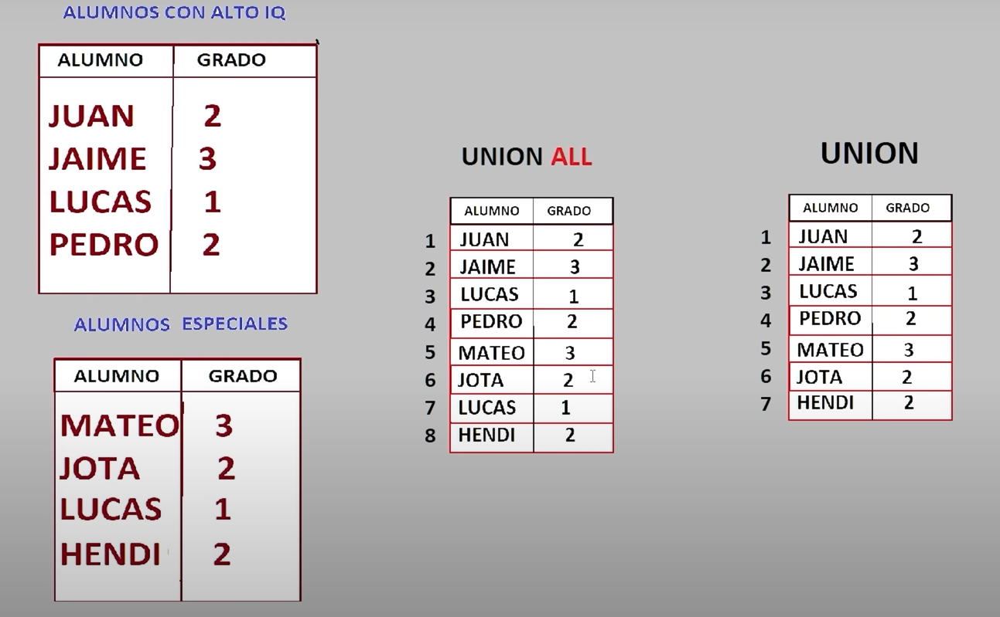
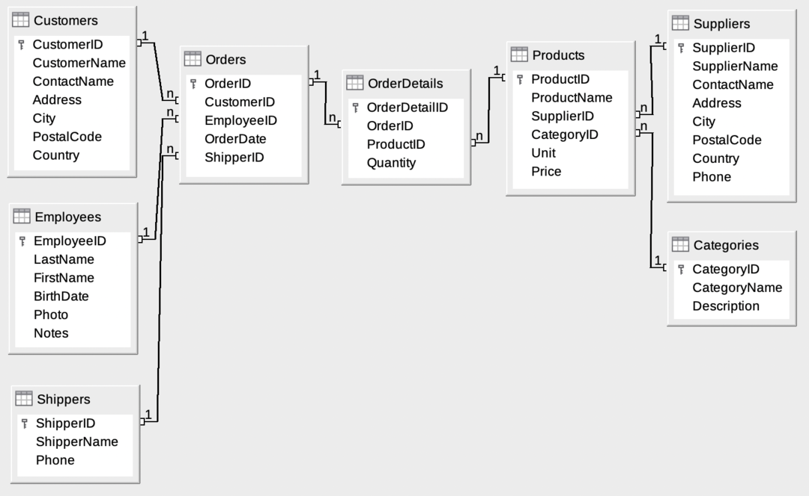
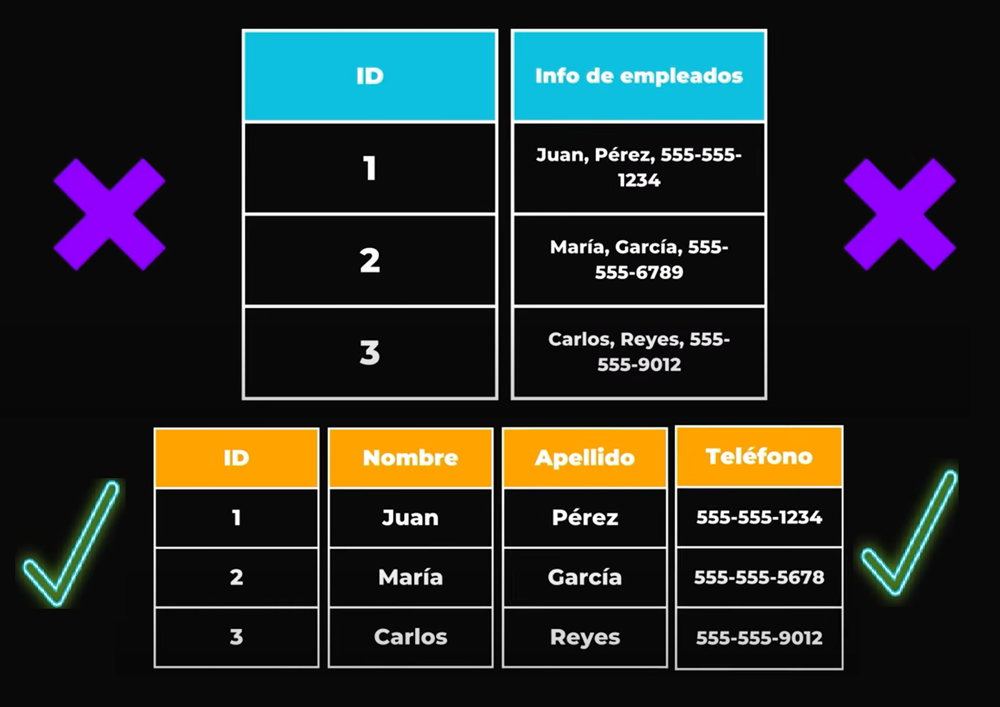
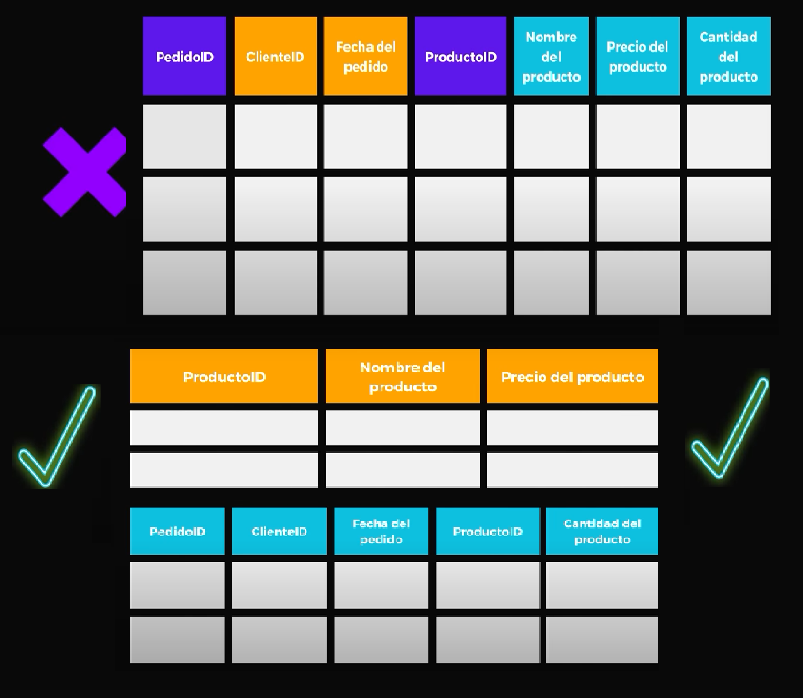
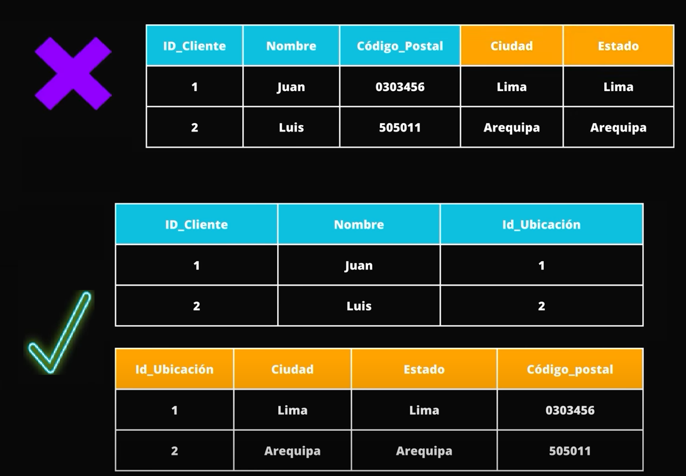
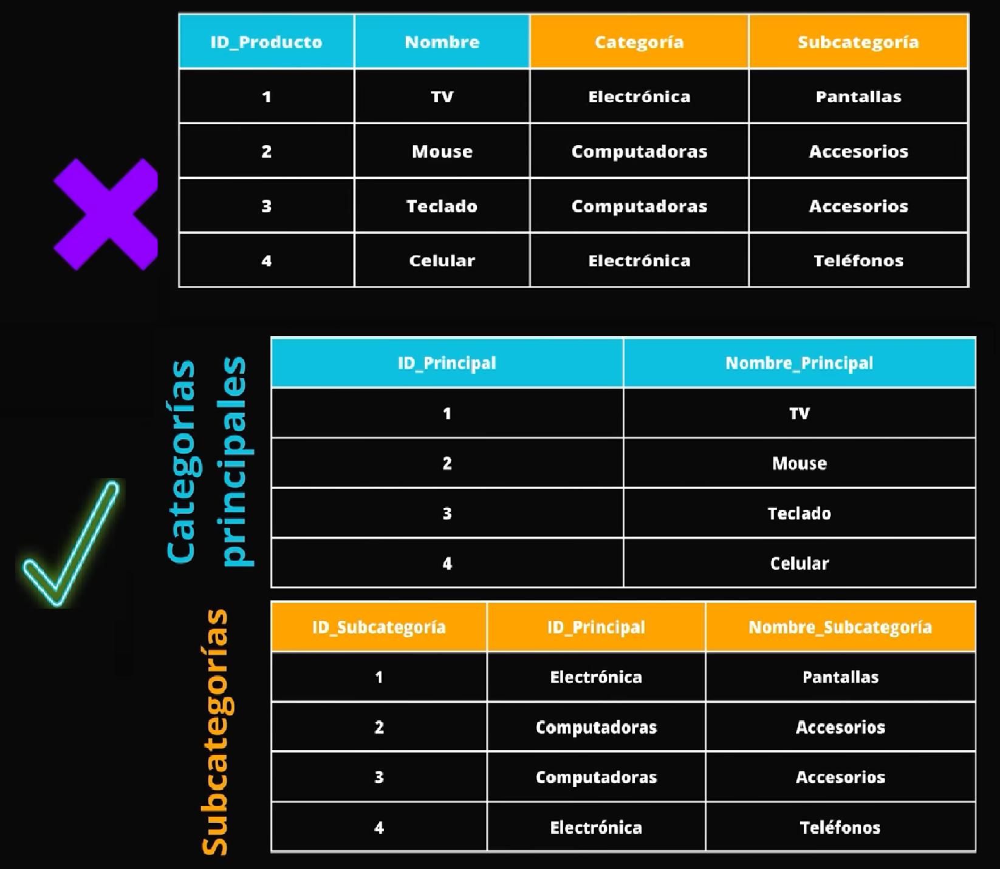
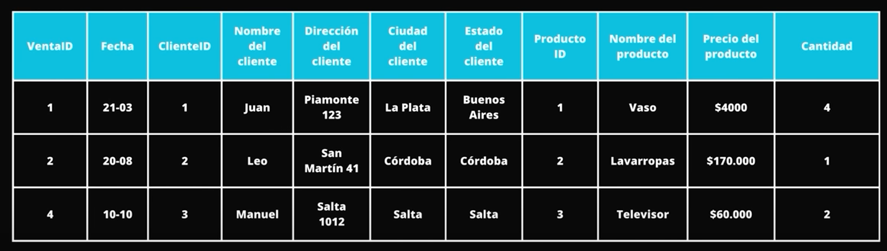
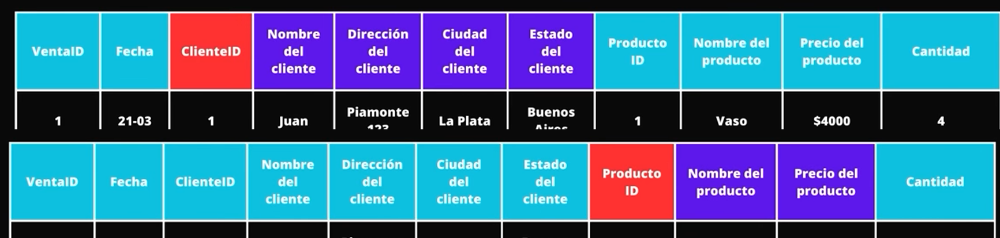
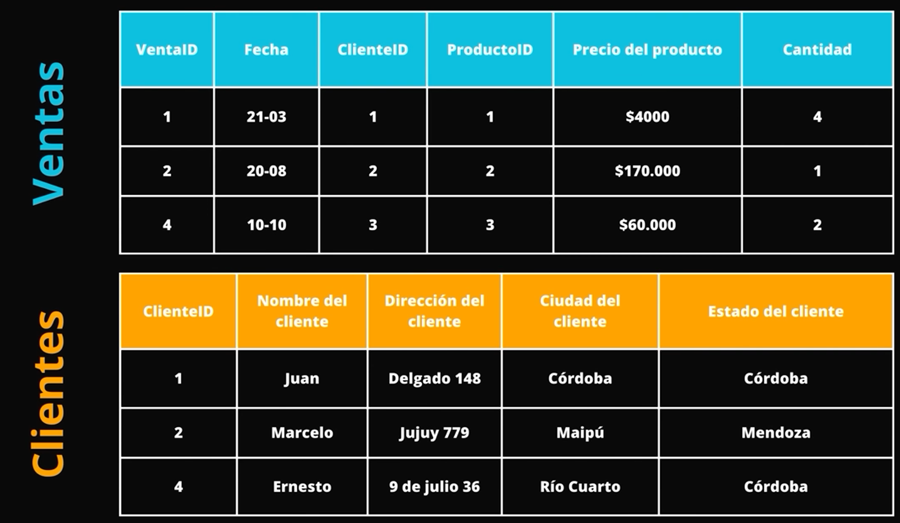

## 1. **Funciones de Agregacion**

Se realizan con la consulta "SELECT funcion()"

```SQL
-- Funcion COUNT() = Conteo
SELECT COUNT(FirstName) FROM Employees
SELECT COUNT(FirstName) AS Cantidad_de_nombres FROM Employees
-- Funcion SUM() = Suma
SELECT SUM(Price) FROM Products
-- Funcion AVG() = Promedio
SELECT AVG(Price) FROM Products
-- Funcion ROUND() = Redondeo
SELECT ROUND(AVG(Price)) FROM Products
SELECT ROUND(AVG(Price),2) FROM Products
-- Funcion MIN()  = Minimo
SELECT ProductName, MIN(Price) FROM Products WHERE ProductName IS NOT NULL
-- Funcion MAX()  = Maximo
SELECT ProductName, MAX(Price) FROM Products WHERE ProductName IS NOT NULL
-- ETC.......
```

## 2. **GROUP BY**

GROUP BY es una manera de realizar conjuntos.

<p align="center">
    
</p>

En este codigo se obtiene el precio promedio por SupplierID.

```SQL
SELECT SupplierID, Price AS Promedio FROM Products
GROUP BY SupplierID
ORDER BY Promedio DESC
```

El problema con el codigo anterior es que regresara el primer registro encontrado, en este caso el menor precio para cada SupplierID. Para solucionarlo se tiene que realizar una funcion de agregacion.

Aqui ya no muestra el menor precio sino el precio promedio.

```SQL
SELECT SupplierID, ROUND(AVG(Price),2) AS Promedio FROM Products
GROUP BY SupplierID
ORDER BY Promedio DESC
```

Otro problema es que no se puede realizar condiciones sobre la variable agrupada. Es decir, el siguiente codigo regresa un error:

```SQL
SELECT SupplierID, ROUND(AVG(Price),2) AS Promedio FROM Products
WHERE Promedio > 40
GROUP BY SupplierID
ORDER BY Promedio DESC
```

Para resolverlo utilizamos HAVING despues de realizar la agrupacion

```SQL
SELECT SupplierID, ROUND(AVG(Price),2) AS Promedio FROM Products
GROUP BY SupplierID
HAVING Promedio > 40
ORDER BY Promedio DESC
```

Pero si se puede utilizar el WHERE para filtrar registros que no sean la funcion de agregacion

```SQL
SELECT SupplierID, ROUND(AVG(Price),2) AS Promedio FROM Products
WHERE SupplierID NOT IN (1,2)
GROUP BY SupplierID
HAVING Promedio > 10
ORDER BY SupplierID ASC
```

## 3. **SUBQUERIES**

Una subconsulta se ejecuta antes de la consulta principal, la cual utiliza el resultado de la subconsulta.

El resultado de la subconsulta no puede modificar a la base de datos, solo puede extraer informacion.

```SQL
SELECT ProductID,
       Quantity,
       -- No se pueden usar alias dentro de las subconsultas
       -- Para hacer referencias en la subconsulta a otra tabla, siempre incluir el nombre de la tabla referenciada
	   (SELECT ProductName FROM Products WHERE ProductID = OrderDetails.ProductID) AS NombreProducto,
	   (SELECT Price FROM Products WHERE ProductID = OrderDetails.ProductID) AS Precio
FROM OrderDetails
```

Subconsulta dentro de un SELECT:

```SQL
SELECT
	ProductID,
	SUM(Quantity) AS total_vendido,
	(SELECT Price FROM Products WHERE ProductID = OD.ProductID) AS Precio,
	(SELECT ProductName FROM Products WHERE ProductID = OD.ProductID) AS Nombre_Producto,
	(SUM(Quantity) * (SELECT Price FROM Products WHERE ProductID = OD.ProductID)) AS Total_recaudado
FROM [OrderDetails] OD
GROUP BY ProductID
ORDER BY Total_recaudado DESC
```

Subconsulta dentro de un WHERE:

```SQL
SELECT
	ProductID,
	SUM(Quantity) AS total_vendido,
	-- (SELECT Price FROM Products WHERE ProductID = OD.ProductID) AS Precio,
	(SELECT ProductName FROM Products WHERE ProductID = OD.ProductID) AS Nombre_Producto,
	(SUM(Quantity) * (SELECT Price FROM Products WHERE ProductID = OD.ProductID)) AS Total_recaudado
FROM [OrderDetails] OD
WHERE (SELECT Price FROM Products WHERE ProductID = OD.ProductID) > 40
GROUP BY ProductID
ORDER BY Total_recaudado DESC
```

Subconsulta dentro de un FROM

```SQL
SELECT Nombre_Producto, Total_recaudado FROM (
	SELECT
		ProductID,
		SUM(Quantity) AS total_vendido,
		(SELECT Price FROM Products WHERE ProductID = OD.ProductID) AS Precio,
		(SELECT ProductName FROM Products WHERE ProductID = OD.ProductID) AS Nombre_Producto,
		(SUM(Quantity) * (SELECT Price FROM Products WHERE ProductID = OD.ProductID)) AS Total_recaudado
	FROM [OrderDetails] OD
	WHERE Precio > 40
	GROUP BY ProductID
	ORDER BY Total_recaudado DESC
)
WHERE Total_recaudado > 100
```

EJERCICIO CON SUBCONSULTA:

- Relacionar 3 tablas
- Obtener empleados que lograron vender mas unidades que el promedio

```SQL
SELECT
	EmployeeID,
	FirstName,
	LastName,
	(SELECT SUM(OD.Quantity)
		FROM [ORDERS] O, [OrderDetails] OD
		WHERE O.EmployeeID = E.EmployeeID AND OD.OrderID = O.OrderID) AS U_vendidas
FROM [Employees] E
WHERE U_vendidas > (SELECT AVG(U_vendidas) FROM (
	SELECT (SELECT SUM(OD.Quantity)
			FROM [ORDERS] O, [OrderDetails] OD
			WHERE O.EmployeeID = E2.EmployeeID AND OD.OrderID = O.OrderID) AS U_vendidas
	FROM [Employees] E2
	GROUP BY E2.EmployeeID
))
```

## 4. **JOINS**

Un JOIN se utiliza para juntar dos tablas para crear otra.

Clasificacion de JOINS:

- Inner join
- Left join
- Right join
- Full join
- Cross join

---

**CROSS JOIN**: Se utiliza para realizar combinaciones entre tablas. La fantidad de filas final, sera la multiplicacion entre la cantidad de filas de la tabla A \* la cantidad de filas de la tabla B.

<p align="center">
    
</p>

```SQL
-- NOTA: La tabla Orders tiene 196 filas, la tabla Employees tiene 10 filas

-- Manera implicita
SELECT * FROM Employees E, Orders O

-- Manera explicita
SELECT * FROM Employees E
CROSS JOIN Orders O
```

---

**INNER JOIN**: Devuelve la informacion presente en una tabla A y tambien en una tabla B, teniendo como condicion de union lo estipulado en una clausula ON. Es decir, incluye solo la informacion presente en ambas tablas.

<p align="center">
    
</p>

```SQL
-- Manera implicita
SELECT * FROM Employees E, Orders O
WHERE E.EmployeeID = O.EmployeeID
-- Manera Explicita
SELECT * FROM Employees E
INNER JOIN Orders O
-- Manera Corta
SELECT * FROM Employees E
JOIN Orders O
```

---

**LEFT JOIN**: Devuelve la informacion presente en una tabla A y parte de la informacion en una tabla B. Es decir, incluye a toda la tabla A y solo los datos que coincidan en ON de la tabla B. Los datos que no coinciden se rellenan con NULL.

<p align="center">
    
</p>

```SQL
-- NOTA: La tabla mencionada despues de LEFT JOIN será la tabla B. Es decir, traer solo los registros que encuentre de esta, y todos los de la mencionada en el SELECT.
SELECT FirstName, LastName, Reward, Month FROM Employees E
LEFT JOIN Rewards R ON R.EmployeeID = E.EmployeeID
```

---

**RIGHT JOIN**: Devuelve la informacion presente en una tabla B y parte de la informacion en una tabla A. Es decir, incluye a toda la tabla B y solo los datos que coincidan en ON de la tabla A. Los datos que no coinciden se rellenan con NULL.

<p align="center">
    
</p>

```SQL
SELECT FirstName, LastName, Reward, Month FROM Employees E
RIGHT JOIN Rewards R ON R.EmployeeID = E.EmployeeID

-- NOTA: El RIGHT JOIN tambien se puede lograr utilizando las tablas al reves en el LEFT JOIN
-- Simulacion de un RIGHT JOIN:
SELECT FirstName, LastName, Reward, Month FROM Rewards R
LEFT JOIN Employees E ON R.EmployeeID = E.EmployeeID
```

---

**FULL JOIN**: Devuelve la informacion presente en una tabla A y TODA la informacion en una tabla B. Se diferencia del CROSS JOIN en que este no realiza un producto cartesiano, sino que junta ambas tablas literalmente. La simulacion se realiza utilizando un LEFT JOIN y un RIGHT JOIN

<p align="center">
    
</p>

```SQL
-- SIMULACION DE UN FULL JOIN
SELECT FirstName, LastName, Reward, Month FROM Employees E
LEFT JOIN Rewards R ON R.EmployeeID = E.EmployeeID

UNION

-- SIMULACION DE UN RIGHT JOIN
SELECT FirstName, LastName, Reward, Month FROM Rewards R
LEFT JOIN Employees E ON R.EmployeeID = E.EmployeeID
```

---

**UNION** sirve para unir los datos de una consulta con los datos de otra consulta.

Las consultas utilizadas para las uniones deben tener la misma cantidad de columnas con el mismo numero de datos, es decir, no se debe unir una consulta con campos (nombre, apellido) con otra con campos (nombre, apellido, edad) pues la union puede dar resultados extraños.

- UNION ALL: Devuelve todos los registros de ambas columnas
- UNION: Elimina los registros repetidos

<p align="center">
    
</p>

```SQL
-- SIMULACION DE UN FULL JOIN
SELECT FirstName, LastName, RewardID, Reward, Month FROM Employees E
LEFT JOIN Rewards R ON R.EmployeeID = E.EmployeeID

UNION

-- SIMULACION DE UN RIGHT JOIN
SELECT FirstName, LastName, RewardID, Reward, Month FROM Rewards R
LEFT JOIN Employees E ON R.EmployeeID = E.EmployeeID
```

## 5. CARDINALIDAD:

Sirve para determinar la relacion entre tablas.

<p align="center">
    
</p>

TIPOS DE CARDINALIDAD:

- UNO A UNO (1:1) = Un registro en una tabla se relaciona exactamente con un registro en otra tabla. Por ejemplo una persona con su documento de identidad.

<p align="center">
    
</p>

- UNO A MUCHOS (1:n) o MUCHOS A UNO (n:1) = Un registro en una tabla se relaciona con varios registros en otra tabla, o viceversa. Por ejemplo un autor con sus obras.

<p align="center">
    
</p>

- MUCHOS A MUCHOS (n:m) = Un registro en una tabla se relaciona con varios registros en otra tabla, o viceversa. Por ejemplo un estudiante puede tomar varios cursos, un curso puede ser tomado por varios estudiantes. Para llevar acabo esta se debe utilizar otra tabla que vincule las claves primarias de ambas tablas, y que tenga una relacion 1:n con la primera tabla y n:1 con la segunda.

<p align="center">
    
</p>

## 6. NORMALIZACION:

Sirve para eliminar anomalias en la base de datos y mejorar la eficiencia.

Niveles de Normalizacion:

- **PRIMER FORMA NORMAL (1NF)**: Garantizar que cada atributo contenga un valor unico atomico, es decir, los valores de una columna no deben de ser una estructura de datos compleja (lista, conjuntos). Tampoco debe haber repeticiones en una misma fila para una clave primaria.

<p align="center">
    
</p>

- **SEGUNDA FORMA NORMAL (2NF)**: Cada atributo que no sea una clave (KEY) debe depender completamente de la clave primaria. No debe haber dependencias parciales.

<p align="center">
    
</p>

- **TERCERA FORMA NORMAL (3NF)**: Cada atributo debe depender directamente de la clave primaria y no de atributos que no son claves. No debe de haber dependencias transitivas.

<p align="center">
    
</p>

- **CUARTA FORMA NORMAL (4NF)**: Cada tabla debe tener una clave primaria compuesta que consta de multiples columnas en lugar de 1 sola.

<p align="center">
    
</p>

- **QUINTA FORMA NORMAL (5NF)**: Se asegura que no haya dependencias de union entre atributos.

# -------------------------------------------------

**COMO NORMALIZAR UNA TABLA**:

<p align="center">
    
</p>

1. Identificar Clave Primaria.

<p align="center">
    
</p>

2. Identificar dependencias funcionales.

<p align="center">
    
</p>

3. Dividir Tabla segun dependencias funcionales.

<p align="center">
    
</p>

4. ETC......
