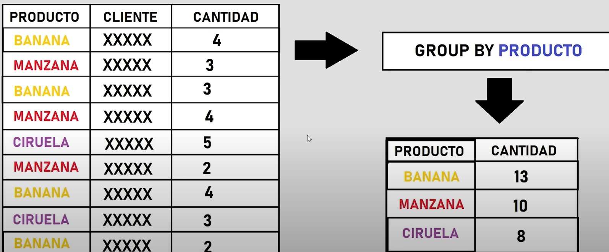

## 1. **Funciones de Agregacion**

Se realizan con la consulta "SELECT funcion()"

```SQL
-- Funcion COUNT() = Conteo
SELECT COUNT(FirstName) FROM Employees
SELECT COUNT(FirstName) AS Cantidad_de_nombres FROM Employees
-- Funcion SUM() = Suma
SELECT SUM(Price) FROM Products
-- Funcion AVG() = Promedio
SELECT AVG(Price) FROM Products
-- Funcion ROUND() = Redondeo
SELECT ROUND(AVG(Price)) FROM Products
SELECT ROUND(AVG(Price),2) FROM Products
-- Funcion MIN()  = Minimo
SELECT ProductName, MIN(Price) FROM Products WHERE ProductName IS NOT NULL
-- Funcion MAX()  = Maximo
SELECT ProductName, MAX(Price) FROM Products WHERE ProductName IS NOT NULL
-- ETC.......
```

## 2. **GROUP BY**

GROUP BY es una manera de realizar conjuntos.

<p align="center">
    
</p>

En este codigo se obtiene el precio promedio por SupplierID.

```SQL
SELECT SupplierID, Price AS Promedio FROM Products
GROUP BY SupplierID
ORDER BY Promedio DESC
```

El problema con el codigo anterior es que regresara el primer registro encontrado, en este caso el menor precio para cada SupplierID. Para solucionarlo se tiene que realizar una funcion de agregacion.

Aqui ya no muestra el menor precio sino el precio promedio.

```SQL
SELECT SupplierID, ROUND(AVG(Price),2) AS Promedio FROM Products
GROUP BY SupplierID
ORDER BY Promedio DESC
```

Otro problema es que no se puede realizar condiciones sobre la variable agrupada. Es decir, el siguiente codigo regresa un error:

```SQL
SELECT SupplierID, ROUND(AVG(Price),2) AS Promedio FROM Products
WHERE Promedio > 40
GROUP BY SupplierID
ORDER BY Promedio DESC
```

Para resolverlo utilizamos HAVING despues de realizar la agrupacion

```SQL
SELECT SupplierID, ROUND(AVG(Price),2) AS Promedio FROM Products
GROUP BY SupplierID
HAVING Promedio > 40
ORDER BY Promedio DESC
```

Pero si se puede utilizar el WHERE para filtrar registros que no sean la funcion de agregacion

```SQL
SELECT SupplierID, ROUND(AVG(Price),2) AS Promedio FROM Products
WHERE SupplierID NOT IN (1,2)
GROUP BY SupplierID
HAVING Promedio > 10
ORDER BY SupplierID ASC
```

## 3. **SUBQUERIES**

Una subconsulta se ejecuta antes de la consulta principal, la cual utiliza el resultado de la subconsulta.

El resultado de la subconsulta no puede modificar a la base de datos, solo puede extraer informacion.

```SQL
SELECT ProductID,
       Quantity,
       -- No se pueden usar alias dentro de las subconsultas
       -- Para hacer referencias en la subconsulta a otra tabla, siempre incluir el nombre de la tabla referenciada
	   (SELECT ProductName FROM Products WHERE ProductID = OrderDetails.ProductID) AS NombreProducto,
	   (SELECT Price FROM Products WHERE ProductID = OrderDetails.ProductID) AS Precio
FROM OrderDetails
```

Ejemplo de una subconsulta dentro del Select:

```SQL
SELECT
	ProductID,
	SUM(Quantity) AS total_vendido,
	(SELECT Price FROM Products WHERE ProductID = OD.ProductID) AS Precio,
	(SELECT ProductName FROM Products WHERE ProductID = OD.ProductID) AS Nombre_Producto,
	(SUM(Quantity) * (SELECT Price FROM Products WHERE ProductID = OD.ProductID)) AS Total_recaudado
FROM [OrderDetails] OD
GROUP BY ProductID
ORDER BY Total_recaudado DESC
```

Subconsulta dentro de un WHERE:

```SQL
SELECT
	ProductID,
	SUM(Quantity) AS total_vendido,
	-- (SELECT Price FROM Products WHERE ProductID = OD.ProductID) AS Precio,
	(SELECT ProductName FROM Products WHERE ProductID = OD.ProductID) AS Nombre_Producto,
	(SUM(Quantity) * (SELECT Price FROM Products WHERE ProductID = OD.ProductID)) AS Total_recaudado
FROM [OrderDetails] OD
WHERE (SELECT Price FROM Products WHERE ProductID = OD.ProductID) > 40
GROUP BY ProductID
ORDER BY Total_recaudado DESC
```

Subconsulta dentro de un FROM
